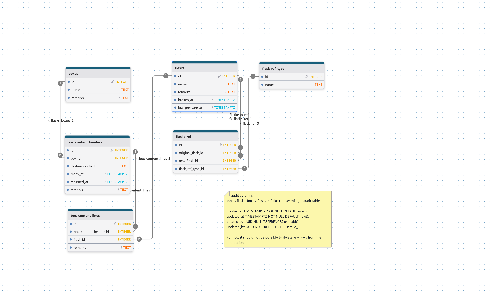

# FlaskTracker Database



## Overview
FlaskTracker-db is a PostgreSQL database designed to track laboratory gas flasks and their shipments in boxes. The system maintains flask inventory, tracks flask relationships (e.g., when flasks are refilled or replaced), and manages the lifecycle of shipping boxes containing flasks.

## Purpose
The database supports:
- Tracking individual laboratory gas flasks and their status
- Recording flask conditions (broken, low pressure)
- Managing shipping boxes and their contents
- Tracking flask shipments to destinations and returns
- Maintaining relationships between flasks (original and replacement/refilled flasks)

## Database Schema

### Core Tables

#### flasks
Main table for tracking laboratory gas flasks.
- `id` - Primary key (auto-generated)
- `name` - Flask identifier (indexed, required)
- `remarks` - Additional notes
- `broken_at` - Timestamp when flask was marked as broken

**Important**: Once a flask is used in `box_content_lines` or `flasks_ref`, its name cannot be updated.

#### boxes
Shipping boxes used to transport flasks.
- `id` - Primary key (auto-generated)
- `name` - Box identifier (indexed, required)
- `remarks` - Additional notes

**Important**: Once a box is used in `box_content_headers`, its name cannot be updated.

#### box_content_headers
Header records for box shipments.
- `id` - Primary key (auto-generated)
- `box_id` - Foreign key to boxes (required)
- `destination_text` - Shipment destination
- `ready_at` - Timestamp when box is ready for shipment
- `returned_at` - Timestamp when box was returned
- `remarks` - Additional notes

**Business Rules**:
- Only one instance of a combination of `box_id` and `ready_at` is allowed
- `returned_at` can only be filled when `ready_at` is filled

#### box_content_lines
Individual flask items within a box shipment.
- `id` - Primary key (auto-generated)
- `box_content_header_id` - Foreign key to box_content_headers (required)
- `flask_id` - Foreign key to flasks (required)
- `remarks` - Additional notes

**Business Rules**:
- The combination of `box_content_header_id` and `flask_id` should be unique

#### flasks_ref
Tracks relationships between flasks (e.g., refills, replacements).
- `id` - Primary key (auto-generated)
- `original_flask_id` - Foreign key to flasks (the original flask)
- `new_flask_id` - Foreign key to flasks (the replacement/refilled flask)
- `flask_ref_type_id` - Foreign key to flask_ref_type

#### flask_ref_type
Types of flask relationships (e.g., "Refilled", "Replaced").
- `id` - Primary key (auto-generated)
- `name` - Type description

#### flask_low_pressure_events
Dedicated table for tracking low pressure events for flasks.
- `id` - Primary key (auto-generated)
- `flask_id` - Foreign key to flasks (required)
- `low_pressure_at` - Timestamp when flask was marked as low pressure (required)

**Purpose**: Allows tracking multiple low pressure occurrences per flask over time. Each row represents a separate low pressure event.

## Key Features

### Flask Status Tracking
- Track when flasks become broken (stored in `flasks.broken_at`)
- Track multiple low pressure events per flask in `flask_low_pressure_events` table
- Each low pressure occurrence is recorded as a separate event with timestamp
- Link broken flasks to their replacements via `flasks_ref`

### Box Shipments
- Record when boxes are prepared for shipment
- Track destination information
- Monitor return status
- View contents (flasks) of each shipment

### Flask Relationships
- Track flask lifecycle through replacement/refill relationships
- Maintain reference to original flask when creating replacements
- Categorize relationship types

### Data Integrity
- Name immutability ensures audit trail integrity
- Foreign key constraints maintain referential integrity
- Unique constraints prevent duplicate entries

## Migrations
Database schema migrations are stored in the `migrations/` directory:
- `0001_initial.sql` - Initial schema creation
- `0002_initial_fixes.sql` - Schema fixes
- `0003_betterauth.sql` - User authentication tables and audit columns
- `0004_unique_names.sql` - Unique constraints on flask and box names
- `0005_flasks_history.sql` - Flask history tracking with automatic triggers (removed in 0008)
- `0006_unique_flask_ref_type_name.sql` - Unique constraint on flask_ref_type.name
- `0007_dml_flasks_ref.sql` - Data manipulation for flask references
- `0008_refactor_low_pressure_tracking.sql` - Replace low_pressure_at column with dedicated events table

To apply migrations, execute the SQL files in order against your PostgreSQL database:
```bash
psql -d your_database_name -f migrations/0001_initial.sql
psql -d your_database_name -f migrations/0002_initial_fixes.sql
psql -d your_database_name -f migrations/0003_betterauth.sql
psql -d your_database_name -f migrations/0004_unique_names.sql
psql -d your_database_name -f migrations/0005_flasks_history.sql
psql -d your_database_name -f migrations/0006_unique_flask_ref_type_name.sql
psql -d your_database_name -f migrations/0007_dml_flasks_ref.sql
psql -d your_database_name -f migrations/0008_refactor_low_pressure_tracking.sql
```

## Schema Diagram
A visual representation of the database schema is available in the `diagram/` directory:
- `FlaskTracker_latest.png` - Current entity relationship diagram
- `FlaskTracker_latest.dbml` - DBML source file for the schema diagram

## Recent Enhancements
- ✅ Audit columns (created_at, created_user_id, updated_at, updated_user_id) added to all tables
- ✅ User authentication tables for tracking who makes changes
- ✅ Unique constraints on flask and box names for data integrity
- ✅ Dedicated low pressure events tracking table for multiple occurrences per flask
- ✅ Simplified schema by removing complex history tracking mechanism

## Future Enhancements
- Consider history tracking for other tables if audit trail needed (boxes, box_content_headers, etc.)
- Functions for common operations (get_flask_low_pressure_history, validate_shipment, etc.)
- Triggers to enforce name immutability when flasks/boxes are referenced

## Database Setup

### Prerequisites
- PostgreSQL database server
- Database client or psql command-line tool

### Installation
1. Create a new PostgreSQL database
2. Execute the migration scripts in order:
   ```bash
   psql -d your_database_name -f migrations/0001_initial.sql
   ```

## Flask Tracking Workflow

### Typical Workflow
1. **Register Flask**: Add new flask entry to `flasks` table
2. **Prepare Shipment**: Create box in `boxes` table (if not exists)
3. **Create Shipment Header**: Add entry to `box_content_headers` with box_id and destination
4. **Add Flasks to Shipment**: Create entries in `box_content_lines` linking flasks to the shipment
5. **Mark Ready**: Update `ready_at` timestamp when box is prepared
6. **Track Return**: Update `returned_at` timestamp when box returns
7. **Update Flask Status**:
   - Set `broken_at` timestamp if flask is broken
   - Add entry to `flask_low_pressure_events` if flask reaches low pressure
8. **Record Replacement**: Create new flask and link via `flasks_ref` if flask needs replacement

## License
(Add your license information here)

## Contact
(Add contact information here)
